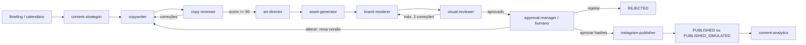

# guincho-marquizelli-social

MVP funcional para planejar, escrever, revisar, renderizar, aprovar, publicar e auditar conteúdo social da **Guincho Marquizelli**. O fluxo padrão é totalmente local e termina em `PUBLISHED_SIMULATED`; nenhuma mensagem ou publicação real ocorre sem configuração e aprovação explícitas.

Canva não é usado nem suportado. A arte final é montada de modo determinístico com HTML/CSS, Playwright e Sharp. A logo e as fotografias reais são camadas bloqueadas.

## Estado atual do inventário

- Manual de marca: encontrado e inspecionado, 15 páginas.
- Logo oficial: encontrada, 4369×1977 PNG com alpha; SHA-256 bloqueado.
- Fontes: Anton 400, Oswald 700, Barlow 400 e Barlow 700 encontradas em WOFF2.
- Fotos reais: quatro originais preservados; `IMG_1773.JPG` foi aprovado para a demonstração sem mudança de bytes.
- Referências visuais: 2 das 5 esperadas foram encontradas; as 3 ausentes não são inventadas.
- Dados comerciais confirmados: nome oficial, reboque de veículos e transporte de veículos.
- Dados ausentes: telefone, WhatsApp, Instagram, endereço, área, horários, preços, pagamento e modalidades específicas. Permanecem `null` e bloqueados.

Veja [assets-inventory.json](brand/assets-inventory.json) e [asset-inventory.md](docs/asset-inventory.md).

## Arquitetura

O `WorkflowService` coordena agentes passivos por uma máquina de estados. Agentes não chamam uns aos outros e nenhum agente criativo conhece o token da Meta.



Estados: `IDEA`, `STRATEGY_READY`, `COPY_DRAFT`, `COPY_REVIEW`, `COPY_APPROVED`, `VISUAL_DIRECTION`, `ASSET_PRODUCTION`, `VISUAL_PRODUCTION`, `VISUAL_REVIEW`, `CHANGES_REQUESTED`, `AWAITING_APPROVAL`, `APPROVED`, `SCHEDULED`, `PUBLISHING`, `PUBLISHED`, `PUBLISHED_SIMULATED`, `REJECTED` e `FAILED`.

Os contratos estão em `src/schemas`, as transições em `src/orchestrator/state-machine.ts`, e as regras de coordenação em [AGENTS.md](AGENTS.md).

## Requisitos

- Node.js 20 ou superior;
- npm 10 ou pnpm 10;
- Chrome, Edge ou Chromium local para render; ou Docker;
- PostgreSQL 16 quando for usar persistência de produção;
- credenciais externas apenas para integrações reais.

## Instalação

```bash
cd guincho-marquizelli-social
npm install
copy .env.example .env   # Windows
# ou: cp .env.example .env
npm run typecheck
npm test
```

Atalhos: `scripts/install.ps1` e `scripts/install.sh`.

## Configuração

O arquivo `.env.example` documenta todas as variáveis solicitadas. Valores mais importantes:

- `APP_ENV=dry-run|staging|production` — padrão `dry-run`;
- `ENABLE_REAL_PUBLISHING=false` — deve ser `true` somente na ativação consciente;
- `PUBLISHER_API_KEY` — chave privada de pelo menos 32 caracteres exigida para qualquer chamada à API hospedada; nunca a envie pelo chat;
- `APPROVAL_REQUIRED=true` — produção é recusada se estiver `false`;
- `MAX_AUTOMATIC_REVISIONS=2` — o schema não aceita valor superior a 2;
- `CHROMIUM_EXECUTABLE_PATH` — opcional quando a descoberta automática não encontra navegador;
- `INSTAGRAM_API_VERSION` — fica centralizada; o exemplo usa `v24.0` e deve ser revisado antes de cada implantação;
- `OPENAI_*_MODEL` — modelos configuráveis, sem nome fixo no código;
- `META_ACCESS_TOKEN`, `SUPABASE_SERVICE_ROLE_KEY` e tokens Telegram ficam somente no servidor.

`.env`, chaves e certificados estão no `.gitignore`. O logger aplica redaction a tokens, autorização e chaves.

## Comandos

```bash
npm run dev                 # API local com reload
npm run build               # compila TypeScript
npm run typecheck           # valida tipos
npm test                    # suíte completa, inclusive E2E com PNG real
npm run lint                # typecheck estrito do MVP
npm run render              # render local até revisão visual
npm run workflow:dry-run    # fluxo completo + aprovação/publicação simuladas
npm run telegram:dev        # mostra estado do adaptador mock
npm run publish:dry-run     # alias seguro do dry-run completo
npm run instagram:verify   # valida token/conta sem imprimir o token
npm run seed                # cria briefing demonstrativo em memória
npm run brand:validate      # logo, proporção, fontes, paleta e dimensões
npm run assets:inventory    # inventário e hashes atuais
```

## Agentes e Skills

Cada pasta em `.agents/skills` possui `SKILL.md` com objetivo, acionamento, responsabilidades, entradas, saída, marca, comércio, proibições, critérios, exemplos, erros, dados ausentes e baixa confiança:

1. `content-strategist`
2. `copywriter`
3. `copy-reviewer`
4. `art-director`
5. `asset-generator`
6. `brand-renderer`
7. `visual-reviewer`
8. `approval-manager`
9. `instagram-publisher`
10. `content-analytics`

Comunicação entre agentes é validada por Zod. A máquina de estados, não o agente, decide o próximo passo.

## Estrutura da marca

```text
brand/
  brand.json
  assets-inventory.json
  logos/
  fonts/
  trucks/{originals,approved,processed}/
  references/{visual,content}/
  generated-assets/
  icons/
  prohibited/
```

### Adicionar logo

1. Coloque o arquivo oficial, preferencialmente PNG/SVG com transparência, em `brand/logos/`.
2. Nunca apague a versão anterior; use nome versionado.
3. Atualize `official_file` em `brand.json` e o inventário/hashes.
4. Execute `npm run brand:validate` e os testes.

### Adicionar fontes

1. Copie WOFF2 licenciados para `brand/fonts/`.
2. Atualize `brand.json` e `@font-face` do renderer.
3. Mantenha no máximo duas famílias por peça.
4. Rode teste de carregamento.

### Adicionar fotos dos caminhões

1. Grave o arquivo bruto em `brand/trucks/originals/` e nunca o sobrescreva.
2. Calcule/registre SHA-256 no inventário.
3. Após aprovação humana do arquivo, copie o mesmo byte stream para `approved/`.
4. Qualquer correção permitida vai para `processed/`, com referência ao original.
5. IA generativa jamais recebe a foto para recriar/alterar o caminhão.

### Adicionar referências

Coloque as cinco referências em `brand/references/visual/`. Elas orientam apenas hierarquia e linguagem. Não reutilize pixels, textos, marcas, veículos, logos ou watermarks. Artes legadas que contêm dados não confirmados ficam em `brand/prohibited/`.

## Templates

Há 15 templates com lógicas distintas em `templates/*/template.json`: promo dividido, editorial institucional, stories verticais, objeto hero, alerta diagonal, passos numerados, carrossel em capítulos, dica, veredito, foto dominante, bastidores documentais, campanha de pista, checklist e capa segura de Reel.

Para criar outro template:

1. Crie uma pasta com id em kebab-case.
2. Defina formato, dimensões, margem segura, `layout`, descrição e slots.
3. Implemente a composição determinística no renderer; não use geração de imagem para montar a peça.
4. Adicione testes de overflow, fontes, imagens, logo, contraste e dimensão.

O MVP executa `educativo-alerta` ponta a ponta; os demais já possuem contratos de composição para expansão sem mudanças na orquestração.

## Telegram

No dry-run, `MockApprovalManager` registra envio simulado. Para o bot real:

1. Crie o bot pelo BotFather e defina `TELEGRAM_BOT_TOKEN` no servidor.
2. Defina `TELEGRAM_APPROVER_CHAT_ID` e `TELEGRAM_WEBHOOK_SECRET`.
3. Exponha `POST /webhooks/telegram` por HTTPS e registre o secret token ao configurar o webhook.
4. Use uma lista de aprovadores autorizados no adaptador de identidade antes de produção.

O bot envia preview, copy, formato, data, id, versão, nota e verificações. Callbacks de versão antiga são recusados. Pedidos de alteração usam `POST /api/contents/:id/changes` e criam nova versão; produção deve ligar texto livre recebido pelo bot a esse endpoint.

## Instagram

O adaptador segue o fluxo oficial de Content Publishing: criar container em `/{ig-user-id}/media`, consultar `status_code`, publicar em `/{ig-user-id}/media_publish` e consultar `permalink`. As referências oficiais atuais estão no [workspace da Meta no Postman](https://www.postman.com/meta/instagram/overview) e na [documentação da coleção Instagram API](https://www.postman.com/meta/instagram/documentation/6yqw8pt/instagram-api).

Antes de produção:

1. Use conta profissional compatível e app Meta aprovado.
2. Configure permissões adequadas ao modo de login, conta e revisão vigente.
3. Para Instagram Login, mantenha `INSTAGRAM_LOGIN_MODE=instagram`; o host usado será `graph.instagram.com`.
4. Defina `META_ACCESS_TOKEN`, `PUBLISHER_API_KEY`, `INSTAGRAM_ACCOUNT_ID`, `INSTAGRAM_API_VERSION` e uma `PUBLIC_MEDIA_BASE_URL` HTTPS.
5. Rode `npm run instagram:verify`; a saída mostra apenas id, usuário, tipo da conta e presença das configurações, nunca o token.
6. Confirme que o storage fornece uma URL HTTPS acessível pela Meta. A API expõe os JPEGs derivados em `/media/...` quando implantada publicamente.
7. Rode os testes em staging e publique primeiro em uma conta de teste.
8. Obtenha aprovação humana da imagem e da legenda exatas.
9. Só então defina `APP_ENV=production` e `ENABLE_REAL_PUBLISHING=true`.

O Feed aceita o arquivo editorial 1080×1440 e o Story 1080×1920. Antes do envio, ambos são derivados para JPEG sem alterar o PNG final aprovado. O destino é informado no endpoint de publicação:

```json
{ "target": "feed" }
```

ou:

```json
{ "target": "story" }
```

O token é enviado em header Bearer e nunca aparece em logs ou objetos de agentes. Retry trata 429/5xx como temporários; erros permanentes vão a `FAILED`. `publication_jobs.idempotency_key`, `publications.content_version_id` e `provider_media_id` são únicos.

## API

Principais ações:

```text
POST /api/briefings
POST /api/contents/:id/strategy
POST /api/contents/:id/copy
POST /api/contents/:id/copy/review
POST /api/contents/:id/visual-direction
POST /api/contents/:id/assets
POST /api/contents/:id/render
POST /api/contents/:id/visual/review
POST /api/contents/:id/approval/request
POST /api/contents/:id/approve
POST /api/contents/:id/reject
POST /api/contents/:id/changes
POST /api/contents/:id/redo
POST /api/contents/:id/schedule
POST /api/contents/:id/publish
POST /api/dry-run
GET  /api/contents/:id
GET  /api/contents/:id/history
```

Detalhes e payloads: [api.md](docs/api.md).

## Banco, fila e agendamento

`migrations/001_initial.sql` cria todas as tabelas solicitadas; `002_transition_guard.sql` protege terminais e audita estados. `TaskQueue` fornece concorrência limitada, deduplicação e retry. `ContentScheduler` publica apenas itens `SCHEDULED`; o estado só é alcançado depois de aprovação. Se a aprovação faltar, o horário não muda o estado.

O dry-run usa `InMemoryContentStore` e persiste o bundle de demonstração em `output/`. A interface `ContentStore` permite substituir a persistência pela implementação PostgreSQL/Supabase sem mudar agentes, renderer ou publicador.

## Segurança

- validação HMAC-SHA256 de webhook Meta sobre body bruto;
- secret token no webhook Telegram;
- rate limiting em memória no MVP;
- schemas Zod em fronteiras;
- idempotência em memória e constraints SQL;
- auditoria de estados, versões, aprovações e publicações;
- redaction de logs;
- nenhum secret no cliente;
- assets bloqueados por hash;
- produção com dupla trava de ambiente e aprovação.

Em implantação horizontal, troque rate limit e idempotência em memória por Redis/PostgreSQL.

## Dry-run e primeira demonstração

```bash
npm run workflow:dry-run
```

O comando cria conteúdo educativo sobre pane, produz copy, revisa, define direção, usa triângulo genérico isolado, renderiza 1080×1350 com foto real e logo, revisa, simula Telegram, registra aprovação simulada e executa Instagram simulado. Arquivos esperados:

```text
output/<content-id>/v1/
  final-1080x1350.png
  preview-432x540.png
  texts.json
  assets.json
  visual-direction.json
  copy-review.json
  visual-review.json
  manifest.json
  approvals.json
  publications.json
  transitions.json
  workflow-record.json
  version-history.json
```

## Implantação

### Docker

```bash
docker compose up --build
```

### Railway, Render ou Fly.io

- use o `Dockerfile`;
- anexe PostgreSQL;
- monte storage persistente ou S3/Supabase;
- configure secrets no painel;
- exponha porta 3000;
- rode migrations antes de liberar workers;
- mantenha `dry-run` até concluir staging.

### Vercel/equivalente serverless

A API pode ser adaptada a funções, mas o renderer com Chromium e filas longas deve ficar em worker/container separado. A lógica central é independente do host.

## Solução de problemas

- **Chrome não encontrado:** configure `CHROMIUM_EXECUTABLE_PATH`.
- **Fontes reprovadas:** confirme os quatro WOFF2 e rode `brand:validate`.
- **Logo deformada:** nunca defina largura e altura simultâneas; use `height:auto` e confira hash.
- **Foto reprovada:** restaure o arquivo aprovado com o mesmo SHA-256; não “corrija” o caminhão com IA.
- **Copy bloqueada:** leia `problems`; remova serviço mecânico ou claim sem confirmação.
- **Publicação bloqueada:** verifique estado, aprovador, versão, hashes, URL HTTPS, idempotência e flags.
- **Container Meta em processamento:** o worker consulta status com backoff; não envie outro container com nova chave sem investigar.
- **Vitest em sandbox restrito:** o script já usa `--configLoader runner` para evitar leitura fora do workspace.

## Limitações reais do MVP

- Store principal em memória; migrations de produção estão prontas, mas o adaptador PostgreSQL completo deve ser conectado antes de multi-instância.
- Telegram real envia a peça e trata callbacks simples; a conversa de texto livre para alteração precisa de persistência de sessão antes de produção.
- Apenas `educativo-alerta` está implementado no renderer executável; os outros 14 templates têm contratos distintos, não renders finais ainda.
- Revisão visual do MVP combina checks determinísticos; o adaptador OpenAI configurável está implementado para aprofundar avaliação estética/artefatos quando ativado, sem participar do dry-run.
- Geração de texto usa agentes determinísticos no dry-run; o adaptador OpenAI de Structured Outputs está implementado e mantém a validação Zod antes que qualquer resposta entre no workflow.
- Métricas possuem schema/tabela/provider mock, sem coleta automática real.
- Três das cinco referências visuais esperadas não estavam no workspace.
- Nenhum dado comercial além dos dois serviços confirmados é utilizado.

Essas limitações não reduzem as travas de publicação: qualquer situação insegura bloqueia o avanço.
