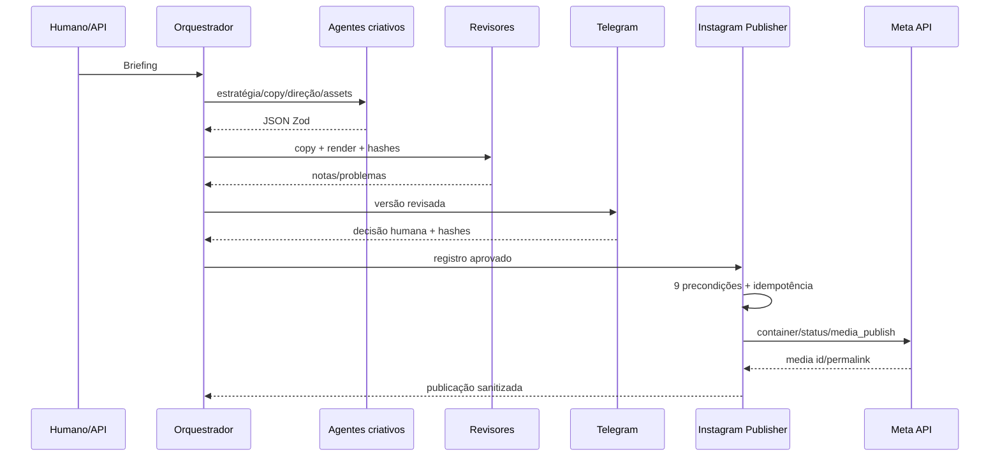

# Arquitetura e limites de confiança

## Limites

- Zona criativa: sem credenciais externas e sem transição autônoma.
- Zona de revisão: somente leitura de outputs, schemas e manual.
- Zona de aprovação: Telegram e banco; sem token Meta.
- Zona de publicação: token Meta, storage e banco; sem geração criativa.
- Assets bloqueados: logo e fotos reais, verificados por hash.

## Portas e adaptadores

`ContentStore`, `AssetProvider`, `ApprovalManager`, `MediaStorage`, `InstagramTransport` e `AnalyticsProvider` isolam infraestrutura. O core não depende de Railway, Render, Fly.io, Vercel, Supabase ou PostgreSQL específico.
